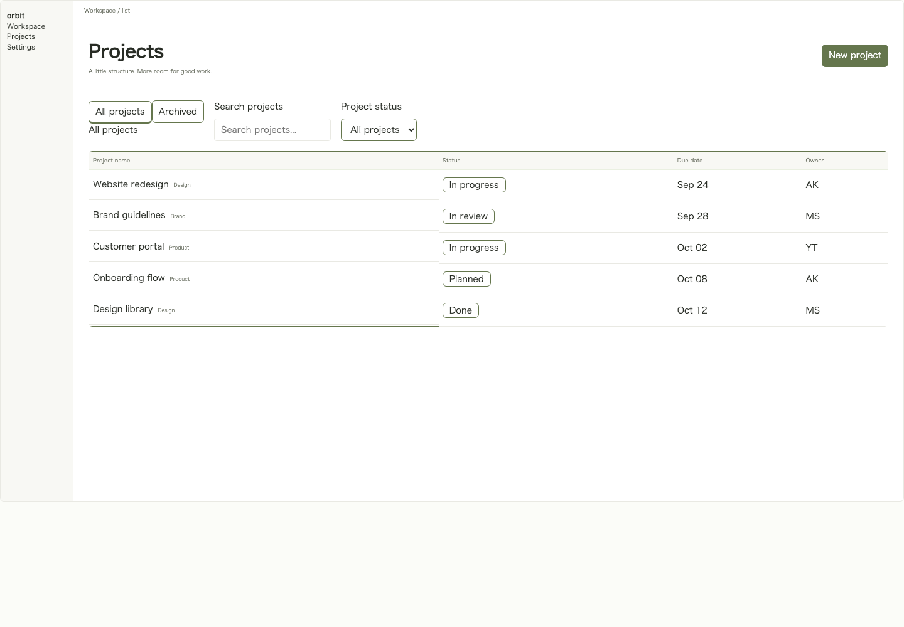
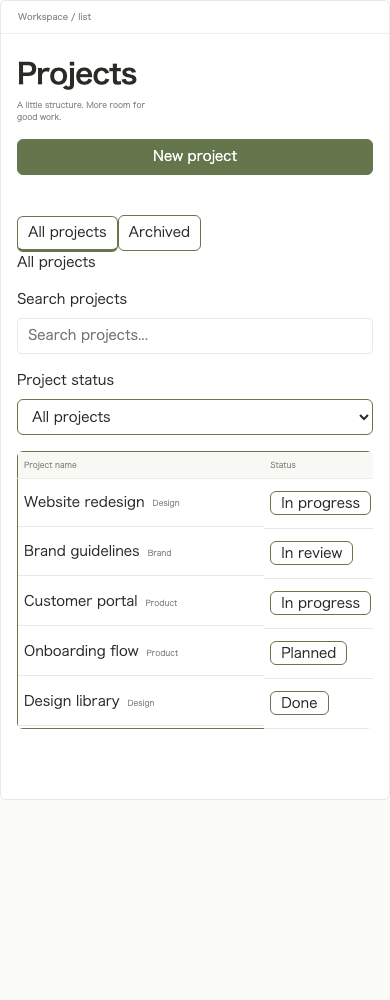
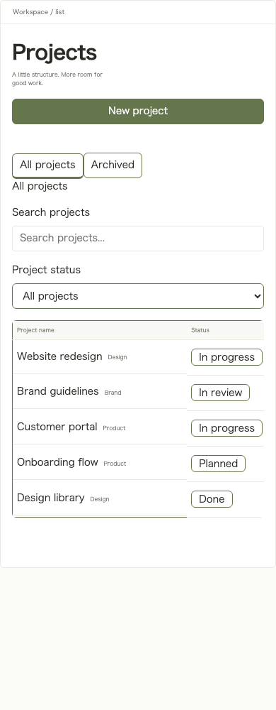

# New Project muted text candidate — human review required

This is a proposed initial color for **newly created Projects only**. Do not merge without human visual approval. The product change sets `muted` to `#6c7164` in the unpublished initial r1 during Project creation. It keeps the schema fallback, `defaultDesign`, existing revisions and legacy imports unchanged.

The existing Review runs axe's WCAG 2 AA checks. Breadcrumbs render at 9px, normal weight; page descriptions render at 9px on desktop and 8px at 390px, normal weight; four list headers render at 9px on desktop and 8px at 390px. Five category labels render at 8px, normal weight. They convey information and require 4.5:1 under [W3C SC 1.4.3](https://www.w3.org/WAI/WCAG22/Understanding/contrast-minimum.html).

| Foreground | White surface `#ffffff` | Canvas `#f8f8f4` |
| --- | --- | --- |
| Original `#878b80` | 3.480:1 | 3.268:1 |
| Candidate `#6c7164` | 5.019:1 | 4.715:1 |

Ratios use the WCAG relative-luminance formula; displayed values are rounded for comparison. Tests use real Chromium/axe on list, settings and form at 1440px and 390px. The fifteen affected findings across the three desktop screens disappear, with no affected `incomplete` results. The old color remains a positive control and is still reported. The actual Review API must complete three captures and verify color contrast.

This color is one possible solution, not a uniquely required value. Main now makes category labels follow the configured muted token (PR #94); this proposal selects no additional value for those labels. The comparison images use the current shared renderer on both sides, including the saved 48px Table row height now rendered by PR #106. This proposal does not choose a new row-height value. Other machine findings, interactive states and overall accessibility are outside this proposal.

## 1440px comparison

| Original | Candidate |
| --- | --- |
|  |  |

## 390px comparison

| Original | Candidate |
| --- | --- |
|  |  |

All images come from the shared renderer, Mock dependencies and isolated SQLite. No real AI or production data is used.
