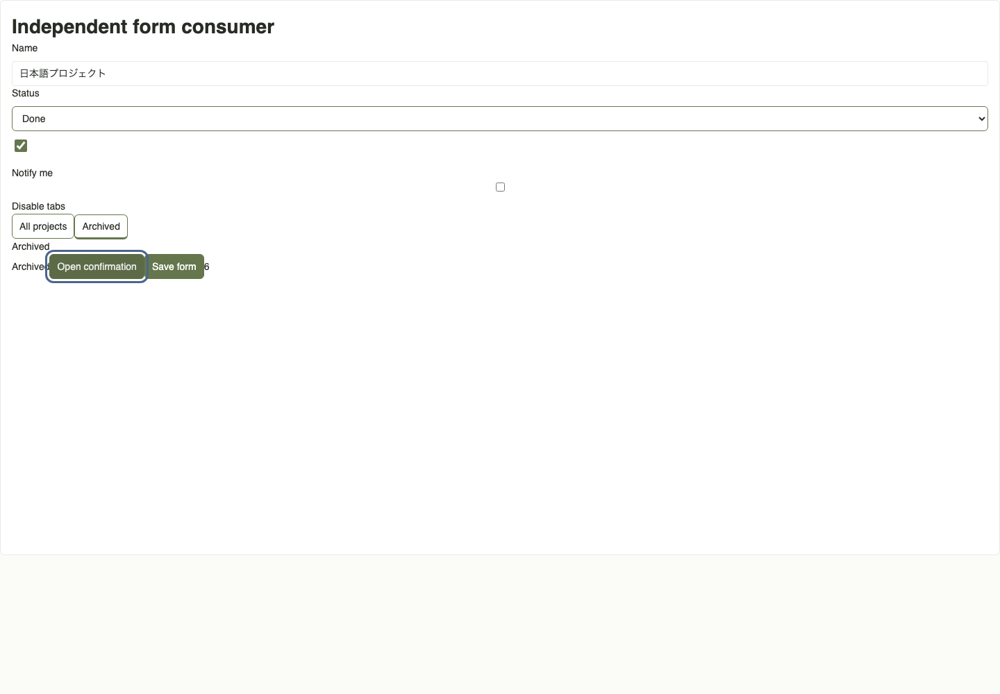
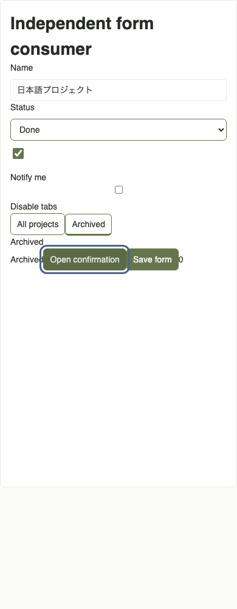

# Export consumer review — Issue #147

The consumer downloads an actual image-free ZIP from the Mock server, extracts it, imports its `ui/index.ts`, and mounts a separate React root on an independent page. It uses no workspace runtime imports. SQLite is temporary and the Mock server audits real Codex calls as zero.

On baseline main `bd72727`, a regular form containing the exported Tabs and Dialog submits six times without activating its Save button: tab click / Enter / Space, then dialog Cancel click / Enter and Confirm Space. Arrow navigation and Escape do not submit. The exported Dialog specimen's Open dialog also submits its enclosing form once. Both defects reproduce at 1440px and 390px.

The four internal operation buttons now use `type="button"`. The general Button wrapper continues to pass native props through, and consumers' explicit or implicit submit buttons retain their behavior. New ZIPs use `preview-8`; seeded frozen `preview-6` and `preview-7` exports, their archive bytes and Foundation revisions remain unchanged. Repeated exports reuse the new record.

| Width | Before: six unintended submits | After: zero unintended submits |
| --- | --- | --- |
| 1440px |  |  |
| 390px |  |  |

Ten new browser cases use the downloaded ZIP. They cover the two form integrations above plus standalone List / Settings / Form pages at both widths: keyboard tab selection, Home / End / arrows, disabled tabs, modal focus wrap / restore / Escape, Japanese input, checkbox Space, native required/email validation and focus, loading/disabled/busy feedback, correction and successful submit, list creation by Enter, filtering and empty state, and document overflow. An explicit Save submits the consumer form exactly once. Existing hydration / ARIA ownership and pattern-order checks also pass.

This is a bounded Chromium consumer review. The ZIP remains Draft: other component states, other browsers, application-specific data/actions and CSS isolation beyond the documented independent-page / iframe usage have not been certified. No new design policy, API, real AI run or authentication change is included.
