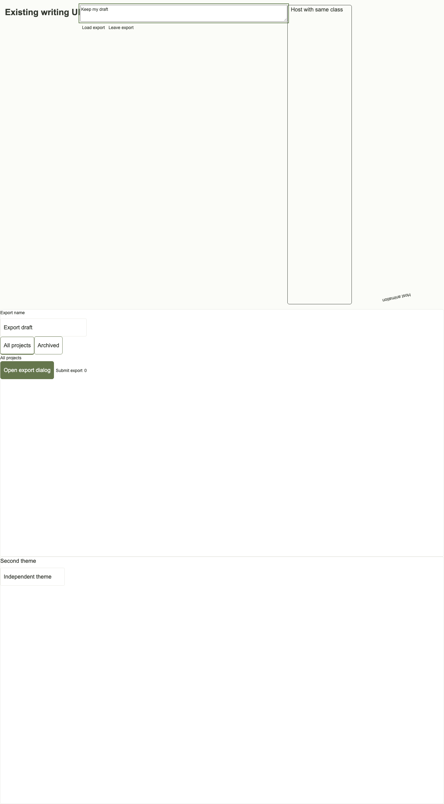
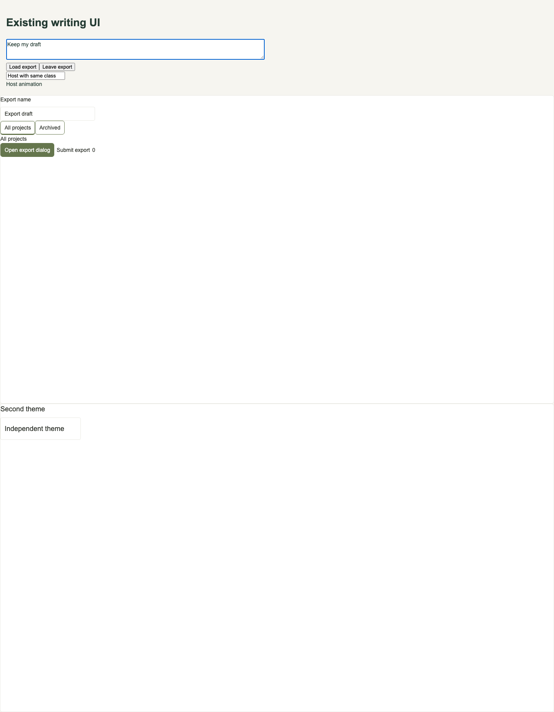
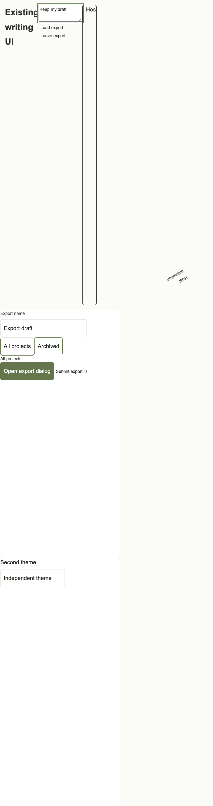
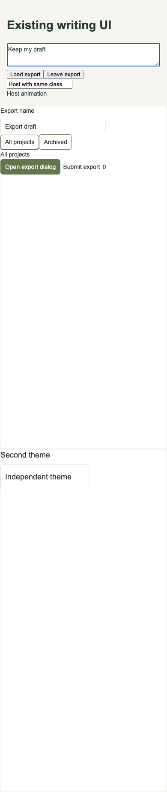
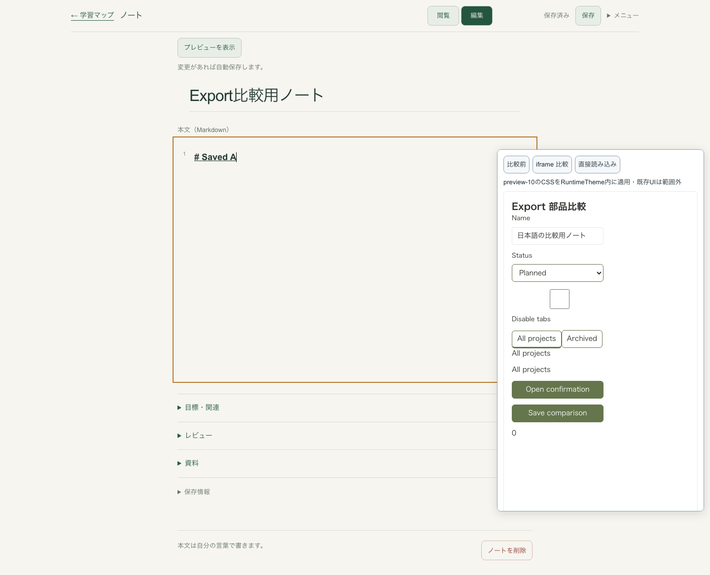
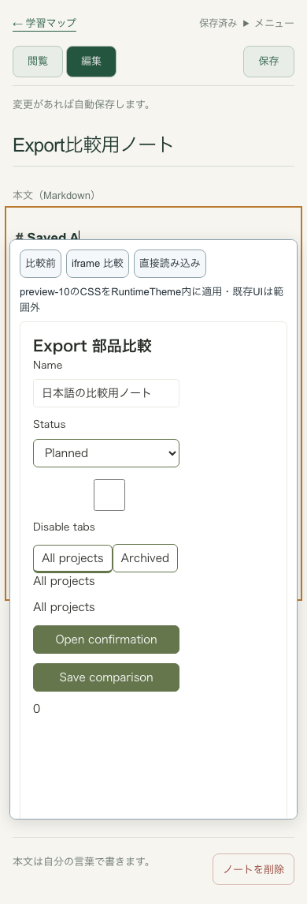

# Export CSSの局所化 — Issue #151

既存React画面で実際のZIPを直接読み込むと、`preview-9`の`:root`、全体リセット、汎用クラスとRuntimeThemeの動的CSSがホストまで変えていた。Kakudoの限定試用では紙色 `#f6f5f0 → #f5f6ef`、文字色 `#233a32 → #30352d`、タイトル幅 `672 → 630px` が変化し、SPAで比較画面を閉じてもCSSが残った。

`preview-10`ではZIPの `ui/styles.css` と `tokens/variables.css` をCSS/selector ASTで `:where(.tasteprint-runtime)` 内へ限定する。ルート自身に当たるセレクタと子孫に当たるセレクタを分け、通常セレクタへのscope追加では詳細度を増やさず、media query・`::backdrop` を保持する。全体の初期値はRuntimeThemeルートへ移し、所有するkeyframes名を局所化する。動的な部品・パターンCSSはuseIdの属性で各RuntimeThemeを指定し、兄弟テーマが互いの寸法を変えない。通常アプリの `src/client/styles.css` は変更しない。

同梱3画面にはRuntimeThemeが含まれる。生のButton/Input等は `ui/design` の設計とRuntimeThemeで包む。新ZIPのREADMEに直接読み込み、独立ページでのbody余白設定、既存ホストへの導入条件を記載した。CSS変換の依存関係は生成側だけに追加し、利用側ZIPの依存関係は増やしていない。

| 検証 | 結果 |
| --- | --- |
| 1440 / 390px × 通常 / reduced motion の独立ホスト | 修正前4件で色・クラス・transition漏れを再現。修正後4件で読み込み前・後・SPA退出後の計測値が全て一致 |
| 実ZIPの部品操作 | Tabs矢印、DialogのTab循環・disabled除外・Escape/フォーカス復帰、入力保持、親フォーム誤送信なし、明示送信、兄弟テーマ分離 |
| 通常Previewと実ZIP3画面 × 2幅 | 修正前の通常Preview6画像と修正後の通常Previewがbyte一致。新ZIP6画像も通常Previewとbyte一致 |
| 旧ZIP | 実際の凍結済みpreview-9を新生成と併存させ、旧レコード・ZIPバイト・revision履歴の不変を検査。既存preview-6/7/8検査も通過 |
| ローカル検証 | typecheck、29ファイル157単体テスト、重点22 E2E、test:builtの起動・PNG/ZIP検証が成功 |

視覚比較の消費側ページには通常Previewと同じ `lang=ja`、撮影背景、body余白を呼び出し側で指定した。言語によるgeneric fontの選択と角の透過ピクセルの背景を揃えるためで、ZIPがホストdocumentの設定を変更するものではない。[6組の画像ハッシュ](./export-css-scope/visual-comparison.json)を保存している。

| 幅 | 旧ZIP読み込み後 | 局所化ZIP読み込み後 |
| --- | --- | --- |
| 1440px |  |  |
| 390px |  |  |

実装コミット `c12a3bb02ee43af656aadb956c3bd3908e5d5067` からMock・一時SQLite・画像なしで生成した23ファイルのZIPを、Kakudo PR135のhead `17c48a3b169065a96fcf9ec9116db8f1e1491d40` を元にした別worktreeへ無改変で展開した。[由来・各ファイルSHA-256](./export-css-scope/scoped-export-origin.json)。Kakudo mainのPR134変更はこの試用に混ぜていない。PR135自体は更新・マージしていない。

隔離Kakudoのtypecheck・buildと6ブラウザテストが成功した。1440 / 390pxの独立ListPage、直接/iframe双方の部品操作、既存エディタの同一DOM・フォーカス・Undo・autosaveを確認。直接読み込み、比較終了、SPA遷移後もホストの色・幅等を保持した。新しい専用worktree、専用PostgreSQLの55682番、専用テストDB、一時Markdown、43282番だけを使用し、review/searchはMock。元の未コミットファイル、親のworktree/DB、本番データ、認証、実AIに触れていない。

| 幅 | 実Kakudoで直接読み込み |
| --- | --- |
| 1440px |  |
| 390px |  |

範囲はこの生成物とChromiumの限定検証。ホストCSSはExport内へ適用され得る。フォントはdocument全体へ登録される。ネストしたRuntimeThemeの厳密なテーマ隔離、全状態・全ブラウザ、Kakudoの全面採用、アプリ固有API接続は未検証。厳密な双方向のCSS分離が必要ならiframeを使う。以前のレビューのCSS制約は当時のpreview-9に対する記録として残す。
