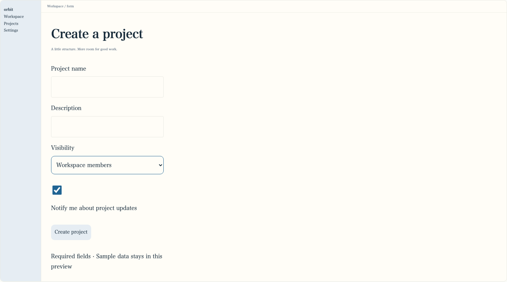
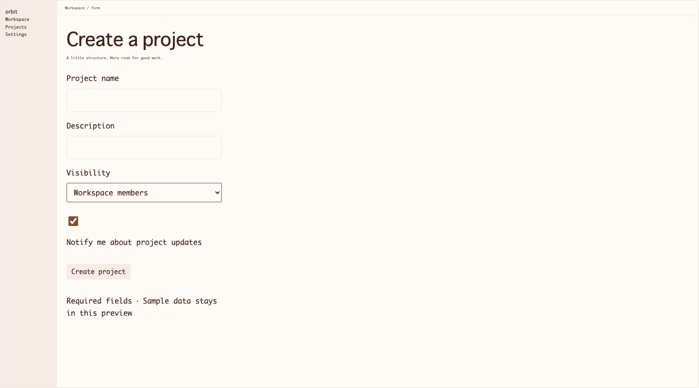
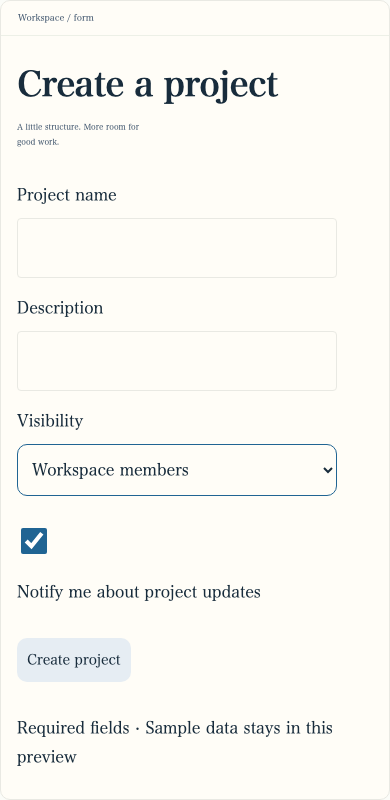
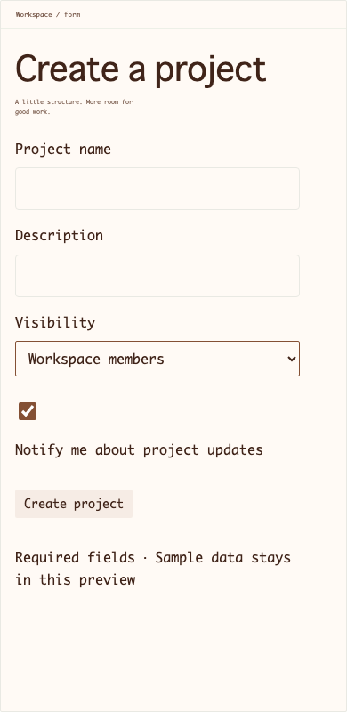

# 編集した保存設計からReact取り込み・再Export — Issue #153

main `07fcb5b` を基準に、実ユーザー保存データを使わない一時SQLiteとMockで、好み・理由・原則をUIから保存した。そこからプロジェクトを作成し、色・タイポグラフィ・寸法・決定理由とロック、Input / Button / FormSectionを明示編集・保存して、実ZIPを別React rootへ取り込んだ。生成側のruntimeを直接importせず、ダウンロードしたZIPのファイルを使っている。Kakudo本体やPR135への変更は含めない。

| 保存した意図 | 1版目 r5 | 2版目 r6 |
| --- | --- | --- |
| 字体・本文サイズ | serif / 16px | monospace / 18px |
| 見出し・本文太さ・行高 | 34px / 500 / 1.8 | 38px / 400 / 1.4 |
| accent / canvas / surface / ink | #206493 / #e6edf3 / #fffdf7 / #182c3c | #845034 / #f6ece5 / #fffaf5 / #402419 |
| controlHeight / Input lg | 52px / 高さ60px・文字18px | 40px / 高さ48px・文字20px |
| Button subtle sm | 高さ44px・文字14px | 高さ32px・文字16px |
| FormSection gap | 32px | 32pxを保持 |

修正前はListと部品詳細のInputが保存値を使う一方、Settings / FormのInput文字が11pxのままだった。2版×2画面×2幅で8件の不一致を記録した。JSON・tokensには正しい値が入り、Previewとportableの画像も一致していたため、保存値と実際のcomputed styleを併せて照合した。

原因はlegacy `.sample-settings input:not([type="checkbox"])` のfont-sizeがRuntimeThemeのルールより優先されること。既存のInput専用高さ補正に `font-size: var(--component-font-size)` を追加し、その変数を既存の本文サイズ＋sm/md/lg差分から供給した。保存値、字体の選択、Button / Selectの文字サイズ計算を変更しない。既定mdもSettings / Formでは11pxからFoundation既定値へ変わる。この2画面の入力表示は意図して修正される。

新ZIPは `preview-11`。生成した実旧preview-9 / preview-10を旧レコードへseedする検査で、旧レコード・ZIPバイト・revision rowsの不変を確認した。新テンプレートの同revision再生成は同じExportを再利用する。履歴を更新・移行する処理は追加していない。

| 検証 | 結果 |
| --- | --- |
| 好み・理由・原則・出典版、色・字体・文字サイズ・部品サイズ・判断理由 | 保存JSONとZIPのdesign-system.json、DTCG、CSS、同梱Reactへ反映 |
| 保存後reload、未保存の2版目とExport | 保存値を復元し、未保存変更は1版目ZIPへ混ざらない |
| r5 → 保存r6 → 再Export | 別revisionの新Exportを作成。同revision再生成を再利用し、旧ZIPをbyte保持 |
| 実プロジェクトPreview・通常renderer・portable | 2版×3画面×2幅のcomputed styleが一致し、通常rootとportableの12画像ペアがbyte一致 |
| 同梱の1440px全ページPNG | 独立撮影と寸法一致。角の微小な描画差は最大23pixelで、許容上限0.01%を下回る。こちらはbyte一致を主張しない |
| 操作 | Tabs矢印、DialogのTab循環・Escape・フォーカス復帰・Enterによる行追加、Settings/Formの必須・email検証、日本語入力、checkboxのSpace、Enter保存と入力保持 |
| Input sm/md/lg | 1440 / 390pxの部品詳細とList / Settings / Formで保存した高さ・文字サイズを確認 |
| ローカル | typecheck、29ファイル158単体テスト、重点26 E2E、test:built成功。実AI呼び出し0 |

| 幅 | 修正前 serif Form | 修正後 serif Form | 保存し直したmonospace Form |
| --- | --- | --- | --- |
| 1440px |  |  |  |
| 390px |  |  |  |

測定結果は [1440px](./export-edited-consumer/verification-1440.json) / [390px](./export-edited-consumer/verification-390.json)、修正前は同ディレクトリのbeforeファイル。これらは隔離fixtureの記録で、実ユーザーのデザイン選好を代弁するものではない。

追加の強い契約不具合は見つからなかった。この限定レビューはChromiumのみ。フォント登録・ホストCSSの内向き適用・ネストRuntimeThemeの厳密隔離・全状態/全ブラウザ・実アプリAPI接続は従来の確認範囲のまま。Kakudoの全面採用とPR135のmergeは別の採用判断として残す。
