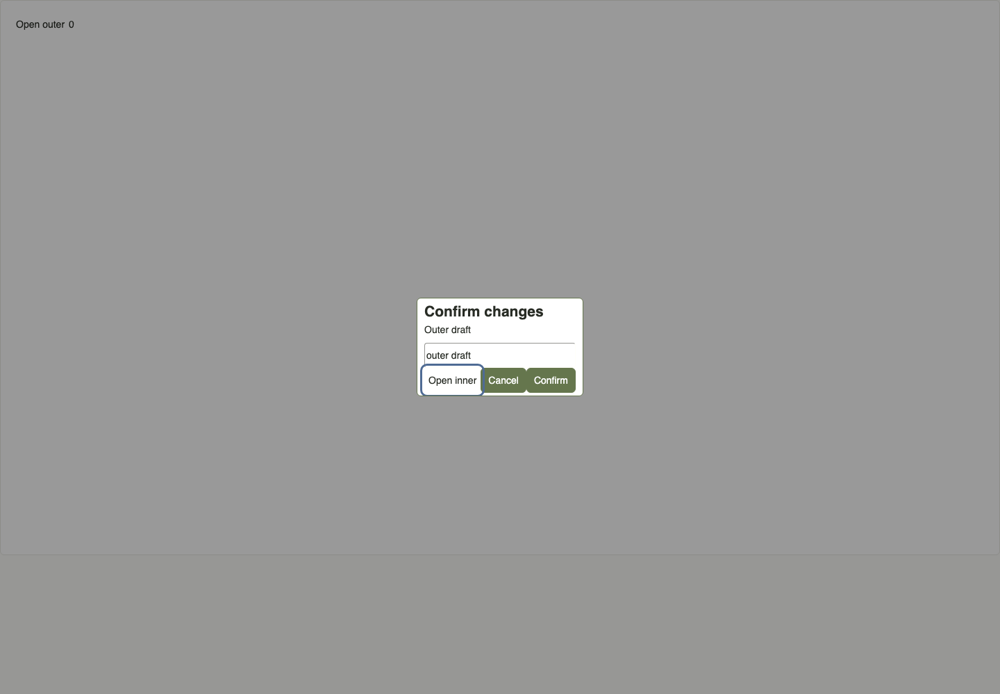
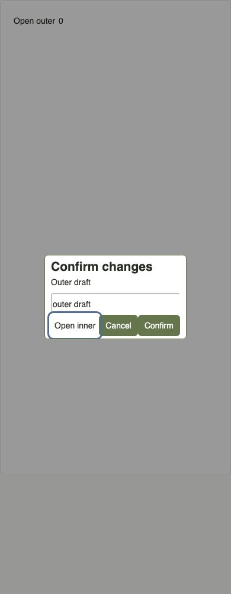

# Nested Export Dialog — Issue #149

This follow-up reviews the previously unchecked nested-modal boundary of an exported consumer form. It downloads and extracts the real ZIP and imports its runtime into an independent React root, using Mock and temporary SQLite. Previously checked single-modal, page and tab cases are not repeated locally.

On main `9f34739`, inner Escape, Cancel by Enter, and Confirm by Space all close the outer Dialog as well and return focus to Open outer. All six cases (1440px / 390px) reproduce this behavior; submit count remains zero. React delivers the inner close/cancel to the ancestor's handlers.

The runtime now handles close/cancel only when the event originates on that Dialog, and handles Tab only for its nearest owning Dialog. The same six cases keep the outer modal open, return focus to Open inner, retain both drafts, skip a disabled inner action, and permit subsequent outer Tab / Shift+Tab before closing the outer modal and restoring focus to Open outer. Native dialog behavior and submit semantics are retained.

| Width | After inner Escape: outer modal and its draft remain |
| --- | --- |
| 1440px |  |
| 390px |  |

New exports use `preview-9`; seeded frozen 6 / 7 / 8 archives, export records and Foundation history remain unchanged. The ZIP README distinguishes typechecking from starting a server, lists the dependencies needed by a consumer, and gives a minimal `createRoot` / ListPage entry. That exact README entry typechecks with the archive and builds in an independent Vite project using the existing installed dependencies; a fresh registry install is not claimed.

For a first user trial, import the ZIP's dependencies into a React host, copy `ui` and `examples` together, mount `examples/ListPage` on an independent page, and run the host's development command. Try Japanese project creation, filtering, keyboard-only controls and narrow width. The examples keep state in memory; application data/API wiring and CSS isolation beyond independent-page / iframe usage remain Draft.
