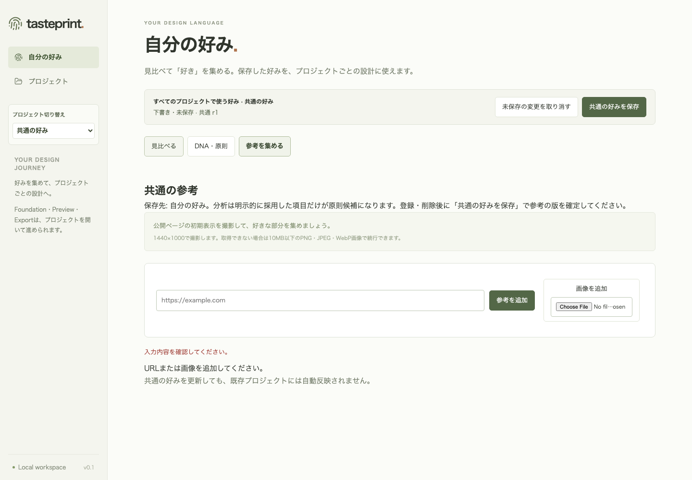
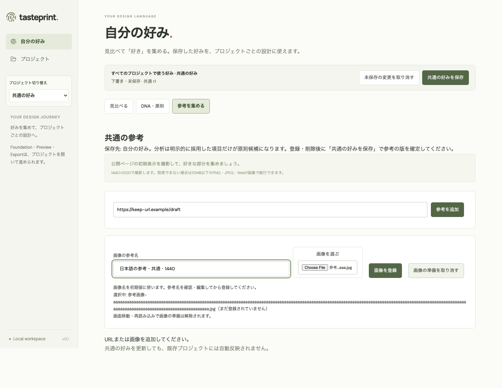
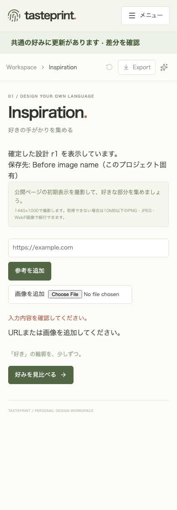
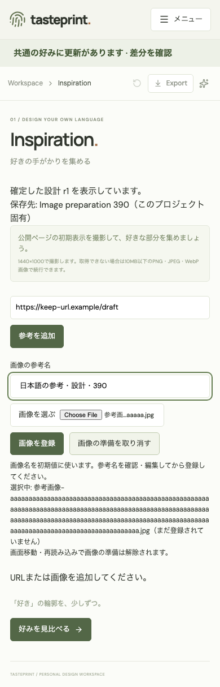

# 画像登録前の参考名編集（Issue #124）

承認された方式に従い、新規画像は「画像を選ぶ → 参考名を確認・編集 → 画像を登録」で追加します。名前を先に入力する順序にも対応します。ファイル名は未編集時だけの初期値で、長い名前を切り詰めず、編集済みの名前をファイル再選択で上書きしません。名前は既存APIスキーマの trim・1〜200文字、サイズは10MB以下を初回POST前に確認します。PNG/JPEG/WebPの既存画像処理は変更しません。

選択・編集・取消はPOST 0。明示登録で初回参考POST、受理後に画像POSTとなります。初回の既知拒否では名前・ファイルを保持し、結果不明では通常再送を停止します。画像の結果確認後に別の追加を準備するときはファイル再選択を要求します。URL側の操作・結果確認では未送信の画像準備を消しません。受理後の画像保存失敗は作成済みカードから続行し、初回POSTを重複させません。名前・ファイル・登録・取消とURL登録はbusy中に保護します。画面移動・再読み込みでは準備が解除されることを画面に示します。

変更前は有効JPEGと206文字のファイル名で初回POST 400、参考なし。変更後は長いファイル名を保持しながら、日本語の短い参考名で画像の登録と表示を確認しました。以下のAfterは登録前の状態で、選択・編集時点のPOSTは0です。Mock・一時SQLiteのみで実Codex呼び出しは0です。

| Profile 1440px: Before | After（名前確認後・登録前） |
| --- | --- |
|  |  |

| Project 390px: Before | After（名前確認後・登録前） |
| --- | --- |
|  |  |

両scope・1440/390pxの12回帰で順序、編集済み空欄、200/201文字、日本語、長いファイル名、PNG/JPEG/WebPの実画像表示、10MB超、取消、初回400再試行、pending、受理後503から同じカードの画像再試行、名前変更後のunknown候補確認、URL側unknownと画像準備の保持を確認します。既存unknown/応答/既知削除の23回帰も同じ保護を確認します。ファイル選択だけで初回登録していた既存fixtureは明示登録操作を追加し、回帰の期待値は維持しています。
