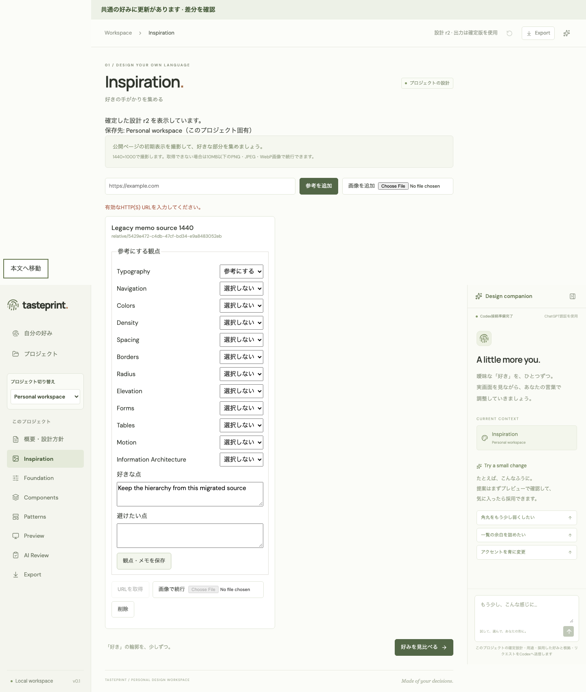
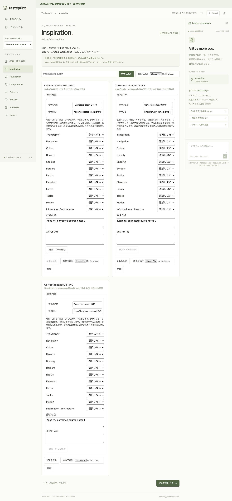
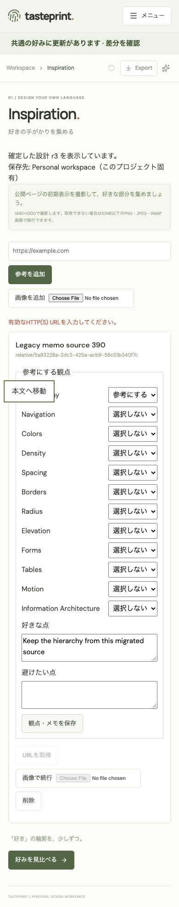
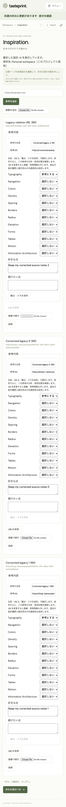
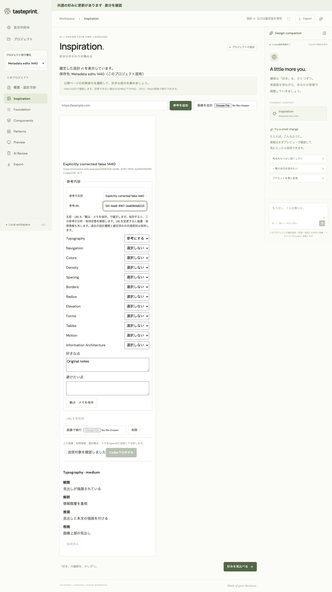
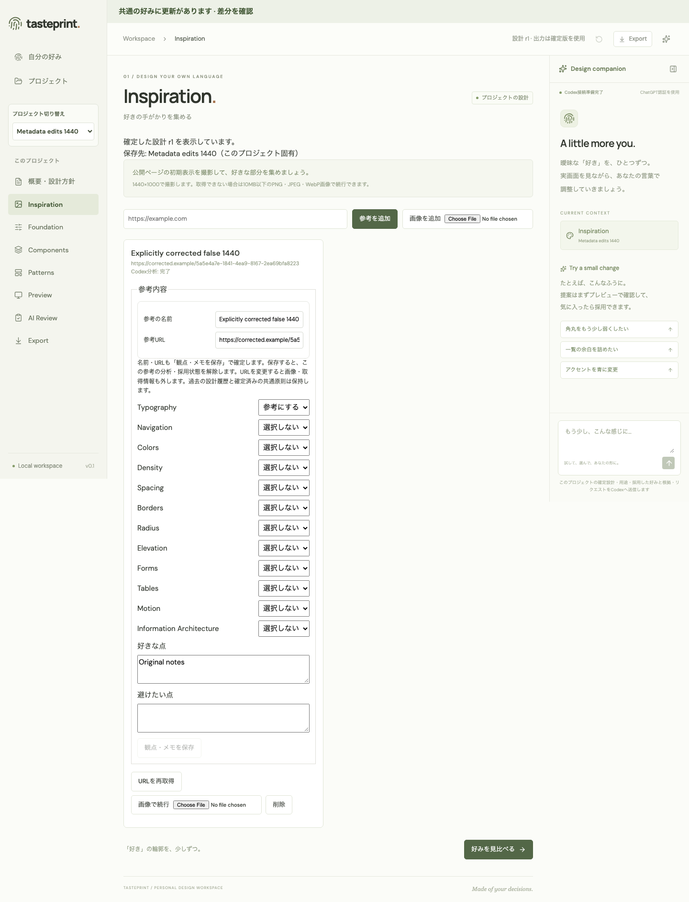
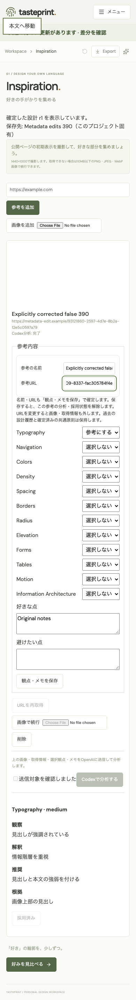
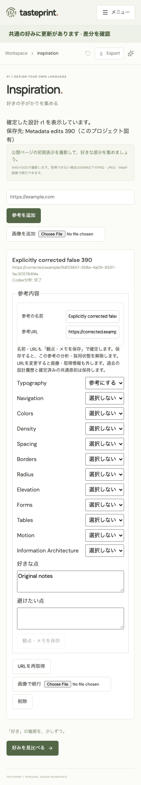

# Reference metadata correction — human review required

Issue #123 records an actual browser import → UI notes PATCH failure: a legal legacy Reference can contain an empty/overlong name or relative URL, but the current card has no way to correct the required metadata. The PATCH returns 400 and preserves both the saved row and local notes draft.

This proposal adds two controlled draft fields in the existing card: **参考の名前** and **参考URL**. It does not transform, truncate or rewrite imported values. The user edits the fields and explicitly presses **観点・メモを保存**. Existing server validation and version checks remain in force. The API still canonicalizes a name only after explicit successful save.

## Saving effects to review

Every successful input PATCH clears this Reference's analysis, analysis job binding and accepted finding indexes. A name change keeps its image and capture metadata. A URL change also removes the current image and capture metadata. Existing design revisions and confirmed Profile principles remain unchanged. These effects are stated next to the new fields; the existing save button now also commits the name and URL.

Name/URL edits are a feature change as well as a legacy repair. Keep this PR draft until the user approves the controls, wording and effects. Technical approval and passing CI do not substitute for human approval.

## Legacy comparison

The before screenshots show the actual 400 and lack of correction controls. The editing screenshots show explicit correction drafts before save. Different isolated test runs create their own synthetic References; compare the controls and operation, not the fixture IDs.

| Width | Before | Correction draft |
| --- | --- | --- |
| 1440 |  |  |
| 390 |  |  |

## Explicit URL change

The first screenshot retains the analyzed image until save and shows the warning. The second shows the new URL with the image and analysis removed after explicit successful PATCH.

| Width | Before explicit save | After save |
| --- | --- | --- |
| 1440 |  |  |
| 390 |  |  |

Six permanent E2E cases use real browser-import/PATCH endpoints, real Mock jobs, normal polling and isolated SQLite. They cover two-width legacy correction, four Profile/Project metadata flows, name canonicalization, original values until explicit save, pending input interlocks, rejected URL drafts across reload, image retention/removal, analysis/acceptance reset and confirmed Profile/Foundation preservation. Reference capture always times out in the E2E Mock; capture metadata removal is an unchanged API rule, not a successful live capture claim. Real Codex calls are zero.
