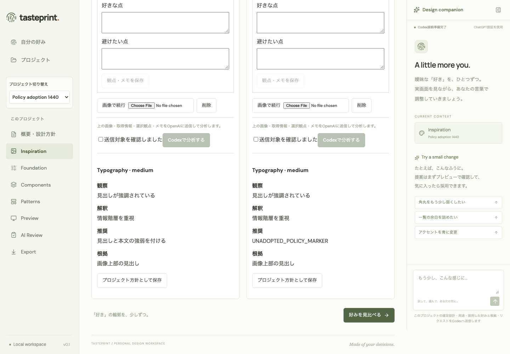
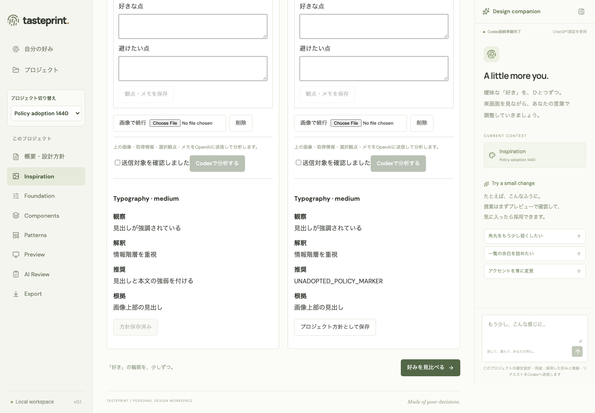
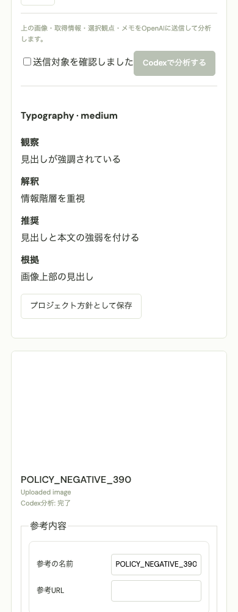
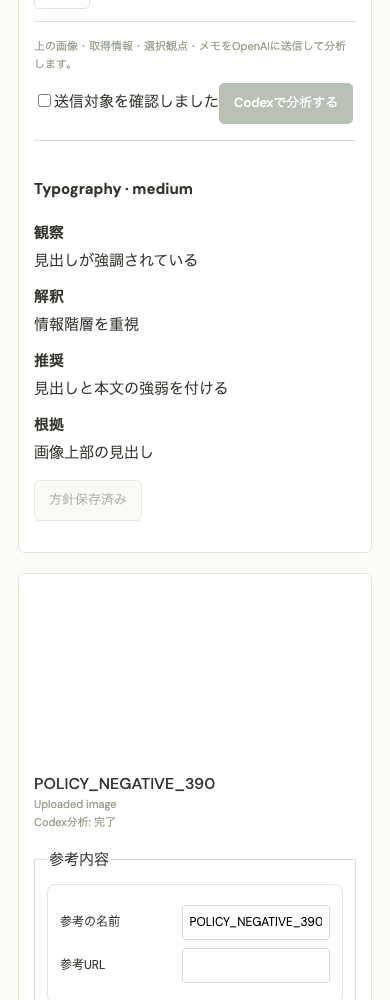

# 参考の明示方針保存と提案・Review・Export — Issue #155

プロジェクトのInspirationで「プロジェクト方針として保存」を押すと、参考の採用と固有方針を同じ新revisionへ確定する。基準mainは `fd11a0729480fbd678083e925706478aa8d639ed`。以前は採用済み参考を後続保存で凍結できたが、明示的なProject方針としてReviewの `project.*` 原則へ一貫して反映する操作がなかった。

保存先・保存時点・提案／Review／Exportへの反映を画面で説明する。Foundationの色・字体・px値、共通プロフィール、他プロジェクト、過去revisionを変更しない。共通参考の従来の採用callbackと「共通の好みを保存」は維持する。

保存済み参考のversion、設計のbaseRevision、方針ID・100件上限・target競合を確認してから、採用状態・新snapshot・保存記録を一つのSQLiteトランザクションへ書き込む。保存中の移動を止め、応答不明時は同じ操作内容を保持する。完全一致する操作のGET確認または同じPOSTの再試行を用い、採用済み表示や方針IDだけから成功を推測しない。新しいrevisionやReference version、取得済みの削除を古い応答で戻さない。

概要のlocalStorage下書きはこの操作で書き換えない。未保存・古い・未読の概要や設計があれば先に保存・取消・復旧を確認する。保存後、既存の概要下書きが古くなった場合は「最新の確定版を読み込む」で方針を確認する。参考の編集・削除でも保存済み方針は保持し、概要で明示編集する。旧Referenceの採用状態だけを自動で方針へ移行しない。

| 検証                                 | 結果                                                                                                                              |
| ------------------------------------ | --------------------------------------------------------------------------------------------------------------------------------- |
| 1440px / 390pxの分析→旧採用→明示保存 | r1からr2へ方針1件を保存。旧採用だけでも新しい保存ボタンが有効                                                                     |
| 実際のMock提案入力 / Review入力      | 同じ推奨・理由・出典が提案snapshotと `project.reference:<id>:0` 原則へ反映。Review画像3枚                                         |
| 未採用の別参考を負の対照に追加       | `UNADOPTED_POLICY_MARKER` の推奨文は提案・Review・新ZIPへ混入しない。参考名などのメタデータはsnapshotに残り得る                   |
| 実際に生成・取得した画像なしZIP      | r2のJSON・Markdownに方針を含む。r1の既存Export ID・ZIPバイト・SHA-256を保持                                                       |
| 未保存入力 / 応答喪失 / 補助GET失敗  | 設計・概要下書き保持、完全一致GET、同payload再送、重複revisionなし。回復後のメモPATCHも最新versionで成功                          |
| 不正な200応答 / 遅いGET / 候補生成中 | 不明な操作を保持して再取得。別Projectのreceiptを採用しない。新しい概要入力を保持し、提案pending／未採用中は方針保存停止           |
| SQLite失敗 / 境界                    | revision挿入失敗で採用・revision・request記録を全rollback。既存policyID・target矛盾・100件・古い版・Project隔離・アーカイブを検証 |
| 旧移行DTO                            | 長い参考名、空selections、25項目の旧採用分析、未知の旧回答キーを保持して明示保存。応答検証に新規入力の制約を再適用しない          |
| ローカル検証                         | typecheck、30ファイル168単体テスト、重点54 E2E、追加16 E2E、test:built。実AI呼び出し0                                             |

| 幅     | 方針保存前                                                       | 方針保存後                                                        |
| ------ | ---------------------------------------------------------------- | ----------------------------------------------------------------- |
| 1440px |  |  |
| 390px  |    |    |

記録は [1440px](./reference-policy/verification-1440.json) / [390px](./reference-policy/verification-390.json)。Mock providerへ渡した実際のprompt・rulesと、取得したZIPのpolicy／reference内容・SHA-256を記録する。白い合成PNGと決定的分析fixtureであり、実モデルの分析品質やユーザーのデザイン感覚を評価するものではない。

検証はChromiumと隔離SQLiteに限定する。方針文を具体的数値へ自動変換せず、実AI・本番デプロイ・認証変更・実ユーザーDB更新・Kakudoへの採用は行っていない。画面内の応答不明状態は再読込をまたいで保持しないが、受理済みの操作記録はProject DBに残る。完全なpending操作の永続化は今回の範囲に含めない。
