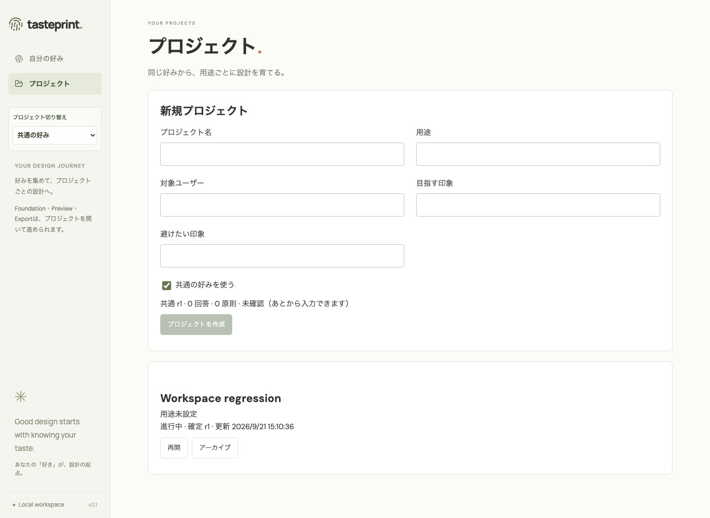
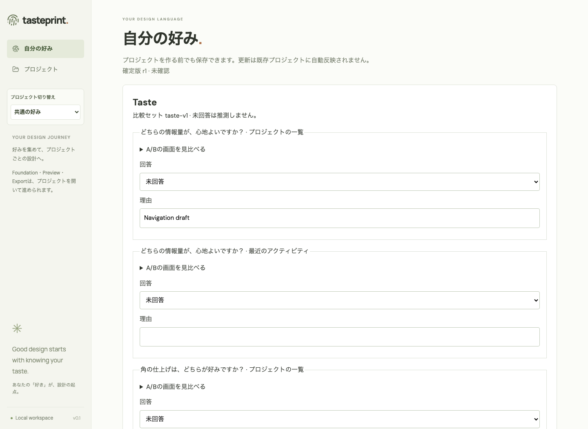
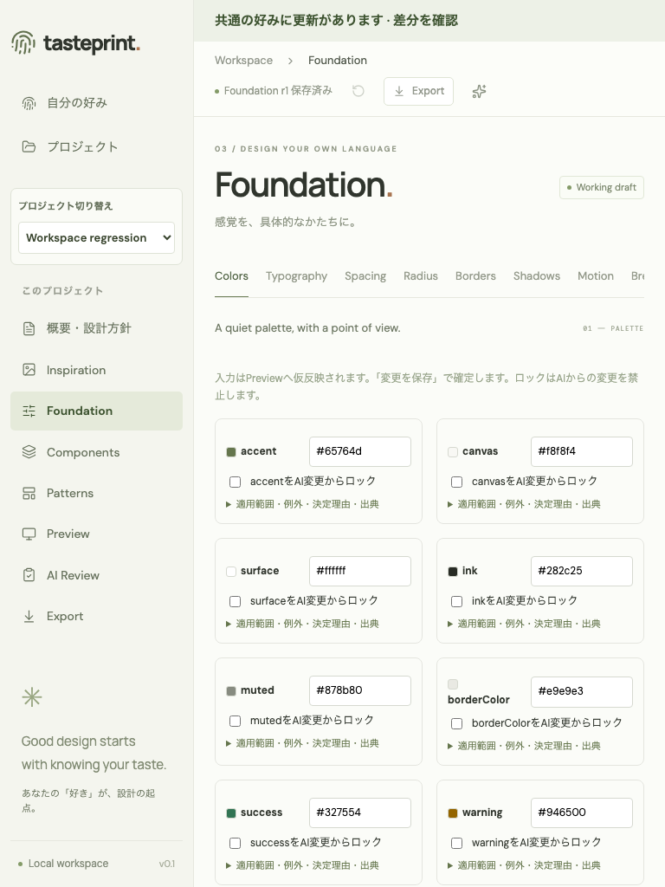
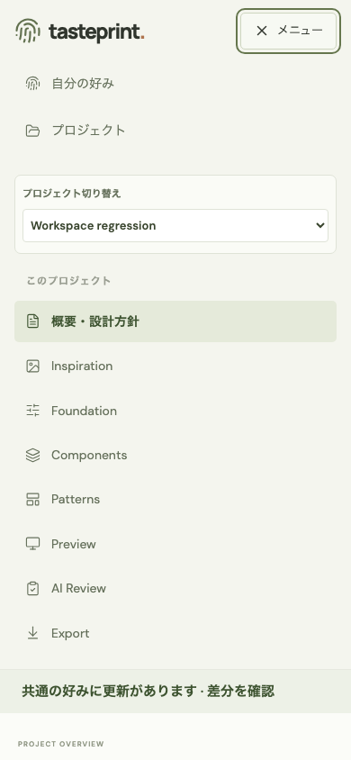

# 共通ナビゲーションのUI確認

2026-09-21。初期画面・共通の好み・概要・設計画面を共通のAppShellで描画し、プロジェクトの選択と現在位置を同じサイドバーに統合しました。上部の重複ナビゲーションと概要のボタン列を整理しています。720px以下は名前付きの折り畳みメニュー、1050px以下は対話パネルを初期状態で閉じて編集領域を確保します。

## 確認した操作

- ルート `/` → 共通の好み → プロジェクト選択 → 概要 → 各設計画面 → 共通の好み → 一覧。サイドバーは1つで、位置と幅、選択項目、プロジェクト別のリンクが正しいことを確認。
- 共通の好みの下書きを入力し、プロジェクトへ移動したあと戻っても保持されることを確認。
- 390pxでメニューをEnterで開き、Escapeで閉じてフォーカスが戻ること、項目選択・プロジェクト切り替え後に閉じることを確認。
- 768pxでロゴ・ナビゲーションが横にはみ出さず、保存状態がパンくずと重ならないことを確認。
- 狭い画面で対話パネルが初期表示を覆わず、必要時に開閉できることを確認。

PlaywrightのE2E16件と機能テスト84件、型チェック・ビルドが成功。最後のレイアウト調整後はナビゲーションのE2E2件を再実行しました。既存の部品テーマ分離テストは、読み込み中のh1ではなくComponentsの見出しを待って色を比較するよう修正しています。

Chromeでも一時SQLiteを使うテスト環境を開き、初期画面からプロジェクトを作成して概要・Foundation・共通の好みを操作し、デスクトップ・768px・390pxを目視しました。ユーザーの保存データは使用していません。AIはfixtureで、実モデルの応答品質やスクリーンリーダーでの読み上げまでは検証対象にしていません。

## 確認画像

以下は一時データを使うE2Eから取得し、目視した修正後の画面です。

### プロジェクト一覧（1440px）

### 共通の好み（1440px）

### Foundation（768px）

### メニュー（390px）

## 別途改善するもの

- [#14: 好みを見比べる体験とDNA・保存導線](https://github.com/taiseimiyaji/tasteprint/issues/14)
- [#15: 再開を優先したプロジェクト一覧](https://github.com/taiseimiyaji/tasteprint/issues/15)
- [#16: 保存状態・操作ラベル・エラー表示の統一](https://github.com/taiseimiyaji/tasteprint/issues/16)

本修正は共通の画面枠とナビゲーションを対象とします。上記のフォーム全体の再設計・検索・保存状態の統一まで完了したものではありません。
